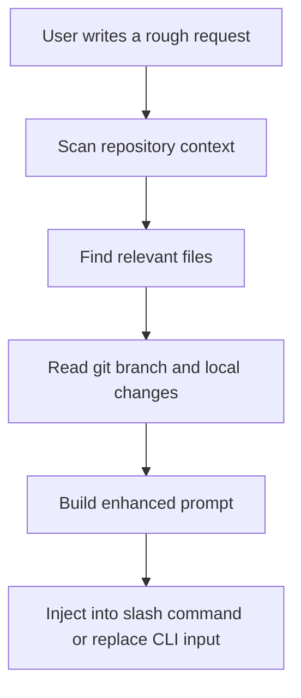

<div align="center">

# 🏹 Chiron

[](LICENSE.txt)
[](https://github.com/EdwinjJ1/chiron-prompt/actions/workflows/ci.yml)
[](https://www.python.org/downloads/)
[](CONTRIBUTING.md)

**Free and open-source Augment Code alternative, and even better for terminal-first Gemini CLI workflows.**

Turn a rough request into a repo-aware execution prompt, then keep working in the same terminal.

[English](README.md) · [简体中文](README.zh-CN.md) · [CLI Guide](cli/README.md) · [Docs](docs/README.md) · [Contributing](CONTRIBUTING.md)

</div>


## Why Chiron

Chiron is built for people who want an Augment-like prompt enhancement flow in the terminal:

- write a rough request
- enhance it with repository context
- keep editing or submit immediately
- stay inside Gemini CLI or Claude Code

The positioning is simple:

- free and open-source
- terminal-first
- repo-aware
- hackable
- a better fit than a heavyweight IDE agent when your main goal is prompt enhancement inside an existing CLI workflow

## What Gets Added During Enhancement

Chiron does not just wrap your text in a fixed template. Before it rewrites a request, it can read:

- project stack and framework
- relevant files and nearby code
- current branch and local git state
- task scope and acceptance criteria
- verification guidance and implementation risks

That is why the output should change with the repository and the task.

## Install Into Existing Gemini CLI

You do not need to run a custom Gemini clone from `/tmp`, and you do not need `npm run start` just to use Chiron.

If you already use the normal `gemini` command, install Chiron into that existing CLI:

```bash
git clone https://github.com/EdwinjJ1/chiron-prompt.git ~/.chiron
node ~/.chiron/cli/bin/install-gemini-command.mjs --name chiron
```

Then open any project and use:

```text
gemini
/chiron fix login bug
```

What the installer does:

- keeps your current `gemini` binary
- writes a Chiron command into `~/.gemini/commands/`
- points that command at Chiron's enhancer with an absolute path

If you want a shorter alias, you can install `/e` instead:

```bash
node ~/.chiron/cli/bin/install-gemini-command.mjs --name e --force
```

## Main Workflows

### 1. Gemini CLI `/chiron` command on your existing install

This is the recommended path for most users.

After running the installer above:

```text
gemini
/chiron 修复登录流程 bug
```

Flow:

1. Chiron scans the repository.
2. Chiron finds relevant files.
3. Chiron builds an enhanced prompt.
4. Gemini executes against the enhanced prompt.

No custom Gemini build is required.

### 2. Project-local Gemini CLI `/e` command

This repository ships a project-level Gemini custom command at [.gemini/commands/e.toml](.gemini/commands/e.toml).

```text
gemini
/e 修复登录流程 bug
```

If this repository is inside the project root, `gemini` can pick up `/e` automatically.

### 3. Gemini CLI in-place enhancement

If you want the closest thing to an Augment-style experience, use the Gemini CLI patch in [cli/patches/gemini-cli/README.md](cli/patches/gemini-cli/README.md).

That path lets you enhance the current input box text in place, keep editing, and only submit when you are ready.

Current status:

- supported through a patch-based integration
- designed for users who want in-place enhancement, not just `/e` commands
- still more experimental than the installed `/chiron` command path

### 4. Claude Code `/e` command

This repository also ships a Claude Code slash command at [.claude/commands/e.md](.claude/commands/e.md).

With the MCP server enabled, `/e` gives a visible enhancement pipeline instead of a silent rewrite.

### 5. Reusable skill

If you only want the reusable skill behavior and do not care about CLI integration, start with [SKILL.md](SKILL.md).

## Before / After

A rough request:

```text
fix login bug
```

A Chiron-style enhanced prompt in a Next.js project might become:

```text
Fix the login flow bug in `src/auth/middleware.ts`.
Project stack: Next.js 14 + TypeScript + Prisma.
Relevant files: `src/auth/middleware.ts`, `src/api/auth/login.ts`, `src/lib/auth.ts`.
Focus on authentication flow, session handling, input validation, and regression risk.
After the change, explain root cause, files changed, and how the fix was verified.
```

The exact output is repository-dependent. In a React CLI project, or a Python backend, Chiron should produce a different enhanced prompt.

## Prompt Enhancement Flow



The implementation behind this flow lives in:

- [cli/src/context-engine.mjs](cli/src/context-engine.mjs)
- [cli/src/enhancer.mjs](cli/src/enhancer.mjs)
- [cli/bin/chiron-enhance.mjs](cli/bin/chiron-enhance.mjs)

## Choose A Mode

| Mode | Best for | Entry point |
|------|----------|-------------|
| Gemini `/chiron` command | Direct use in your existing global `gemini` install | [cli/bin/install-gemini-command.mjs](cli/bin/install-gemini-command.mjs) |
| Project-local Gemini `/e` | Use Chiron from a repo that already contains this project | [.gemini/commands/e.toml](.gemini/commands/e.toml) |
| Gemini in-place enhancement | Augment-like input replacement flow | [cli/patches/gemini-cli/README.md](cli/patches/gemini-cli/README.md) |
| Claude Code `/e` | Repo-aware slash command in Claude Code | [.claude/commands/e.md](.claude/commands/e.md) |
| Skill only | Reusable prompt-enhancement behavior without CLI wiring | [SKILL.md](SKILL.md) |

## Repository Layout

```text
.
├── README.md
├── README.zh-CN.md
├── SKILL.md
├── .gemini/                 # Gemini CLI command integration
├── .claude/                 # Claude Code command + runtime skill assets
├── cli/                     # Enhancer scripts, MCP server, patches, TUI experiment
├── docs/                    # Examples, testing notes, references
├── tests/                   # Pytest coverage for prompt logging helpers
└── prompt-history/          # Optional prompt library/logging
```

## Quick Start

### Existing Gemini CLI install

```bash
git clone https://github.com/EdwinjJ1/chiron-prompt.git ~/.chiron
node ~/.chiron/cli/bin/install-gemini-command.mjs --name chiron
```

Then:

```text
gemini
/chiron explain why this auth middleware fails on refresh
```

### Project-local Gemini CLI command

1. Make sure this repository is available inside the project you want to work on.
2. Start `gemini` from that project root.
3. Run `/e <your request>`.

### Claude Code command

1. Add the MCP server from [cli/README.md](cli/README.md).
2. Keep [.claude/commands/e.md](.claude/commands/e.md) in the project.
3. Run `/e <your request>`.

### Gemini in-place enhancement

1. Patch your local Gemini CLI using [cli/patches/gemini-cli/README.md](cli/patches/gemini-cli/README.md).
2. Point `CHIRON_ENHANCER_PATH` at [cli/bin/chiron-enhance.mjs](cli/bin/chiron-enhance.mjs).
3. Trigger enhancement from the Gemini input box, then continue editing before submit.

This path is optional. Most users should start with the existing `gemini` install plus `/chiron`.

## Related Docs

- [README.zh-CN.md](README.zh-CN.md)
- [cli/README.md](cli/README.md)
- [docs/README.md](docs/README.md)
- [docs/examples.md](docs/examples.md)
- [docs/testing.md](docs/testing.md)
- [SKILL.md](SKILL.md)

## Contributing

If you change enhancement behavior, keep the bar high:

- preserve repo-aware output instead of fixed templates
- keep CLI behavior predictable
- avoid marketing claims the project cannot prove
- document user-facing shortcuts and integration steps

See [CONTRIBUTING.md](CONTRIBUTING.md) for the normal contribution flow.

## License

This project is licensed under the MIT License. See [LICENSE.txt](LICENSE.txt).
