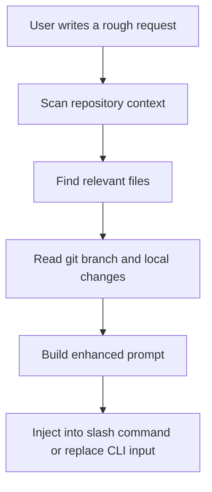

<div align="center">

# 🏹 Chiron

[](LICENSE.txt)
[](https://github.com/EdwinjJ1/chiron-prompt/actions/workflows/ci.yml)
[](https://www.python.org/downloads/)
[](CONTRIBUTING.md)

**Free and open-source Augment Code alternative, and even better for terminal-first Gemini CLI workflows.**

Turn a rough request into a repo-aware execution prompt, then keep working in the same terminal.

[English](README.md) · [简体中文](README.zh-CN.md) · [CLI Guide](cli/README.md) · [Docs](docs/README.md) · [Contributing](CONTRIBUTING.md)

</div>


## Why Chiron

Chiron is built for people who want an Augment-like prompt enhancement flow in the terminal:

- write a rough request
- enhance it with repository context
- keep editing or submit immediately
- stay inside Gemini CLI or Claude Code

The positioning is simple:

- free and open-source
- terminal-first
- repo-aware
- hackable
- a better fit than a heavyweight IDE agent when your main goal is prompt enhancement inside an existing CLI workflow

## Prerequisites

Before you start, make sure these are installed:

| Dependency | Version | Check |
|------------|---------|-------|
| [Node.js](https://nodejs.org/) | 18+ | `node -v` |
| [Git](https://git-scm.com/) | any | `git --version` |
| [Gemini CLI](https://github.com/google-gemini/gemini-cli) | latest | `gemini --version` |

> **Note:** Gemini CLI is Google's official terminal client. Install it with `npm install -g @google/gemini-cli` if you don't have it yet.

## What Gets Added During Enhancement

Chiron does not just wrap your text in a fixed template. Before it rewrites a request, it can read:

- project stack and framework
- relevant files and nearby code
- current branch and local git state
- task scope and acceptance criteria
- verification guidance and implementation risks

That is why the output should change with the repository and the task.

## Install Into Existing Gemini CLI

You do not need to run a custom Gemini clone from `/tmp`, and you do not need `npm run start` just to use Chiron.

If you already use the normal `gemini` command, install Chiron into that existing CLI:

```bash
git clone https://github.com/EdwinjJ1/chiron-prompt.git ~/.chiron
node ~/.chiron/cli/bin/install-gemini-command.mjs --name chiron
```

Then open any project and use:

```text
gemini
/chiron fix login bug
```

What the installer does:

- keeps your current `gemini` binary
- writes a Chiron command into `~/.gemini/commands/`
- points that command at Chiron's enhancer with an absolute path

If you want a shorter alias, you can install `/e` instead:

```bash
node ~/.chiron/cli/bin/install-gemini-command.mjs --name e --force
```

## Main Workflows

### 1. ⭐ Gemini CLI `/chiron` command (recommended)

This is the recommended path for most users. No custom Gemini build required.

After running the installer above:

```text
gemini
/chiron fix login bug
```

Flow:

1. Chiron scans the repository.
2. Chiron finds relevant files.
3. Chiron builds an enhanced prompt.
4. Gemini executes against the enhanced prompt.

### 2. Project-local Gemini CLI `/e` command

This repository ships a project-level Gemini custom command at [.gemini/commands/e.toml](.gemini/commands/e.toml).

```text
gemini
/e fix login bug
```

If this repository is inside the project root, `gemini` can pick up `/e` automatically.

### 3. ⭐ Gemini CLI overlay installer (Augment-style)

One command gives you a user-owned, patched Gemini CLI with double `Ctrl+E` enhance-in-place:

```bash
node cli/bin/install-gemini-overlay.mjs
```

What it does:

1. Copies your global Gemini CLI into `~/.chiron/gemini-cli`
2. Copies Chiron runtime into `~/.chiron/cli`
3. Patches the overlay with double `Ctrl+E` enhancement
4. Writes `~/.local/bin/gemini` wrapper

| Shortcut | Action |
|----------|--------|
| `Ctrl+E` × 1 | Move cursor to end of line (default behavior) |
| `Ctrl+E` × 2 (within 500 ms) | **Enhance prompt in place** (shows `🏹 Chiron enhancing...`), keep editing |
| `Enter` | Submit as normal |

Updating the overlay:

If you update your global Gemini CLI (e.g. `npm update -g @google/gemini-cli`), re-run the installer to bring the overlay up to date:

```bash
node cli/bin/install-gemini-overlay.mjs
```

> **Important:** After updating, you must **quit all running `gemini` sessions** and start new ones. Already-running processes still use the old code loaded into memory.

Rollback:

```bash
rm -f ~/.local/bin/gemini
rm -rf ~/.chiron
hash -r
```

Install locations:

- Wrapper: `~/.local/bin/gemini`
- Overlay Gemini: `~/.chiron/gemini-cli`
- Chiron runtime: `~/.chiron/cli`

> Your original global Gemini CLI stays untouched.

### 4. Gemini CLI in-place patch (manual)

If you'd rather patch the global Gemini CLI directly instead of using an overlay:

```bash
node cli/bin/install-gemini-inplace-enhance.mjs
```

Or apply the patch manually:

```bash
# inside your gemini-cli clone
git apply /path/to/chiron/cli/patches/gemini-cli/double-ctrl-e-enhance-in-place.patch
```

Full details: [cli/patches/gemini-cli/README.md](cli/patches/gemini-cli/README.md)

> **Note:** This path patches your global install. The overlay approach (above) is safer.

### 5. Claude Code `/e` command

This repository also ships a Claude Code slash command at [.claude/commands/e.md](.claude/commands/e.md).

With the MCP server enabled, `/e` gives a visible enhancement pipeline instead of a silent rewrite.

### 6. Reusable skill

If you only want the reusable skill behavior and do not care about CLI integration, start with [SKILL.md](SKILL.md).

## Before / After

A rough request:

```text
fix login bug
```

A Chiron-style enhanced prompt in a Next.js project might become:

```text
Fix the login flow bug in `src/auth/middleware.ts`.
Project stack: Next.js 14 + TypeScript + Prisma.
Relevant files: `src/auth/middleware.ts`, `src/api/auth/login.ts`, `src/lib/auth.ts`.
Focus on authentication flow, session handling, input validation, and regression risk.
After the change, explain root cause, files changed, and how the fix was verified.
```

The exact output is repository-dependent. In a React CLI project, or a Python backend, Chiron should produce a different enhanced prompt.

## Prompt Enhancement Flow



The implementation behind this flow lives in:

- [cli/src/context-engine.mjs](cli/src/context-engine.mjs)
- [cli/src/enhancer.mjs](cli/src/enhancer.mjs)
- [cli/bin/chiron-enhance.mjs](cli/bin/chiron-enhance.mjs)

## Choose A Mode

| Mode | Best for | Entry point |
|------|----------|-------------|
| Gemini `/chiron` command | Direct use in your existing global `gemini` install | [cli/bin/install-gemini-command.mjs](cli/bin/install-gemini-command.mjs) |
| Project-local Gemini `/e` | Use Chiron from a repo that already contains this project | [.gemini/commands/e.toml](.gemini/commands/e.toml) |
| Overlay installer ⭐ | Augment-style double `Ctrl+E` without touching global install | [cli/bin/install-gemini-overlay.mjs](cli/bin/install-gemini-overlay.mjs) |
| In-place patch | Patch global Gemini CLI directly | [cli/bin/install-gemini-inplace-enhance.mjs](cli/bin/install-gemini-inplace-enhance.mjs) |
| Manual patch | `git apply` the `.patch` file yourself | [cli/patches/gemini-cli/README.md](cli/patches/gemini-cli/README.md) |
| Claude Code `/e` | Repo-aware slash command in Claude Code | [.claude/commands/e.md](.claude/commands/e.md) |
| OpenAI Codex TUI | Double `Ctrl+E` enhance-in-place for Codex open-source clone | [cli/patches/codex/](cli/patches/codex/) |
| Claw Code (Rust) | Double `Ctrl+E` enhance-in-place for [claw-code](https://github.com/instructkr/claw-code) | [integrations/claw-code/](integrations/claw-code/) |
| Skill only | Reusable prompt-enhancement behavior without CLI wiring | [SKILL.md](SKILL.md) |

## Repository Layout

```text
.
├── README.md
├── README.zh-CN.md
├── SKILL.md
├── .gemini/                 # Gemini CLI command integration
├── .claude/                 # Claude Code command + runtime skill assets
├── cli/                     # Enhancer scripts, MCP server, patches, TUI experiment
├── integrations/            # Third-party CLI integrations (claw-code, etc.)
├── docs/                    # Examples, testing notes, references
├── tests/                   # Pytest coverage for prompt logging helpers
└── prompt-history/          # Optional prompt library/logging
```

## Quick Start

### Option A: Existing Gemini CLI install (recommended)

```bash
git clone https://github.com/EdwinjJ1/chiron-prompt.git ~/.chiron
node ~/.chiron/cli/bin/install-gemini-command.mjs --name chiron
```

Then:

```text
gemini
/chiron explain why this auth middleware fails on refresh
```

### Option B: Project-local Gemini CLI command

1. Make sure this repository is available inside the project you want to work on.
2. Start `gemini` from that project root.
3. Run `/e <your request>`.

### Option C: Claude Code command

1. Add the MCP server from [cli/README.md](cli/README.md).
2. Keep [.claude/commands/e.md](.claude/commands/e.md) in the project.
3. Run `/e <your request>`.

### Option D: Overlay installer (Augment-style double Ctrl+E)

```bash
node cli/bin/install-gemini-overlay.mjs
```

1. Open a new terminal (or `hash -r`).
2. Run `gemini` in any project.
3. Type your prompt, press `Ctrl+E` twice to enhance in place.
4. Continue editing if needed, press `Enter` to submit.

Rollback: `rm -f ~/.local/bin/gemini && rm -rf ~/.chiron && hash -r`

### Option E: Manual in-place patch

1. Run `node cli/bin/install-gemini-inplace-enhance.mjs`, or
2. `git apply` the patch per [cli/patches/gemini-cli/README.md](cli/patches/gemini-cli/README.md).

### Option F: OpenAI Codex TUI

Chiron directly supports enhancing prompts in the open-source [OpenAI Codex](https://github.com/openai/codex) terminal client with the same double `Ctrl+E` experience.

```bash
node cli/bin/install-codex-overlay.mjs
```

The installer will automatically:
1. Download the latest codex source
2. Apply the double `Ctrl+E` patch
3. Compile the native binary to `~/.chiron/bin/codex`
4. Create a wrapper script at `~/.local/bin/codex`
5. Clean up the source files so no temporary code is left behind

As long as `~/.local/bin` is in your `PATH`, you can simply run `codex` to enjoy the experience.

### Option G: Claw Code (Rust CLI)

Integrate Chiron's prompt enhancement into [claw-code](https://github.com/instructkr/claw-code), an open-source Claude Code alternative built in Rust.

```bash
# Apply the patch to your claw-code clone
cd /path/to/claw-code
git apply ~/.chiron/integrations/claw-code/ctrl-e-enhance.patch
cd rust && cargo build --package rusty-claude-cli --release

# Run with double Ctrl+E enhancement
./target/release/claw
```

Full details: [integrations/claw-code/README.md](integrations/claw-code/README.md)

## Related Docs

- [README.zh-CN.md](README.zh-CN.md)
- [cli/README.md](cli/README.md)
- [docs/README.md](docs/README.md)
- [docs/examples.md](docs/examples.md)
- [docs/testing.md](docs/testing.md)
- [SKILL.md](SKILL.md)

## Contributing

If you change enhancement behavior, keep the bar high:

- preserve repo-aware output instead of fixed templates
- keep CLI behavior predictable
- avoid marketing claims the project cannot prove
- document user-facing shortcuts and integration steps

See [CONTRIBUTING.md](CONTRIBUTING.md) for the normal contribution flow.

## License

This project is licensed under the MIT License. See [LICENSE.txt](LICENSE.txt).
