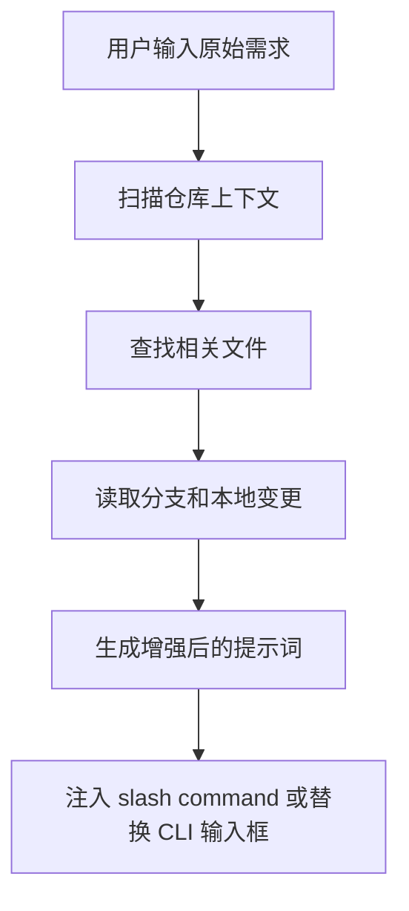

<div align="center">

# 🏹 Chiron

**免费、开源的 Gemini CLI / Claude Code 提示词增强工具。**

把一句模糊需求，增强成带仓库上下文的可执行提示词，并且尽量不离开当前终端工作流。

[English](README.md) · [简体中文](README.zh-CN.md) · [CLI Guide](cli/README.md) · [Docs](docs/README.md)

</div>

## Chiron 是什么

如果你想要的是一种类似 Augment 的体验，但更偏终端、更轻、更容易自己改，Chiron 的目标很明确：

- 先写一句原始需求
- 根据代码仓库上下文增强提示词
- 可以继续编辑，也可以直接执行
- 尽量保持在 Gemini CLI 或 Claude Code 里完成

它更适合这类场景：

- 你主要想增强提示词，而不是换一整套 IDE 工作流
- 你希望能看到或控制增强过程
- 你希望它免费、开源、可修改

## 增强时会补什么

Chiron 不是固定模板拼接。它会尽量结合当前仓库去补全这些信息：

- 技术栈和框架
- 相关文件和邻近代码
- 当前分支和本地变更上下文
- 更明确的任务范围和验收标准
- 验证方式、风险点和回归关注点

所以同一句“修复登录 bug”，在不同项目里得到的增强结果应该不一样。

## 主要用法

### 1. Gemini CLI 里的 `/e`

仓库里已经带了项目级 Gemini 自定义命令 [.gemini/commands/e.toml](.gemini/commands/e.toml)。

```text
gemini
/e 修复登录流程 bug
```

执行链路：

1. 扫描项目
2. 查找相关文件
3. 生成增强后的提示词
4. 交给 Gemini 继续执行

这是当前最容易落地、最稳定的用法。

### 2. Gemini CLI 输入框内原地增强

如果你想要更像 Augment 的“直接替换输入框文本”体验，可以看 [cli/patches/gemini-cli/README.md](cli/patches/gemini-cli/README.md)。

这条路径的特点是：

- 在输入框里原地增强
- 增强后还能继续编辑
- 不会强制立即提交

这个模式更接近你想要的体验，但目前仍属于 patch 集成，稳定性和适配性取决于本地 Gemini CLI 环境。

### 3. Claude Code 里的 `/e`

仓库也提供了 Claude Code 命令 [.claude/commands/e.md](.claude/commands/e.md)。

配合 MCP server 后，可以得到一条可见的增强链路，而不是黑盒重写。

### 4. 只用 skill

如果你只想要可复用的 skill 行为，不关心 CLI 集成，就直接看 [SKILL.md](SKILL.md)。

## 示例

原始需求：

```text
fix login bug
```

在 Next.js 项目里，增强后可能会变成：

```text
Fix the login flow bug in `src/auth/middleware.ts`.
Project stack: Next.js 14 + TypeScript + Prisma.
Relevant files: `src/auth/middleware.ts`, `src/api/auth/login.ts`, `src/lib/auth.ts`.
Focus on authentication flow, session handling, input validation, and regression risk.
After the change, explain root cause, files changed, and how the fix was verified.
```

实际结果会跟仓库和需求一起变化，不应该每次都长成一个固定模板。

## 增强流程



相关实现：

- [cli/src/context-engine.mjs](cli/src/context-engine.mjs)
- [cli/src/enhancer.mjs](cli/src/enhancer.mjs)
- [cli/bin/chiron-enhance.mjs](cli/bin/chiron-enhance.mjs)

## 选择哪种模式

| 模式 | 适合谁 | 入口 |
|------|--------|------|
| Gemini `/e` | 想最快上手 | [.gemini/commands/e.toml](.gemini/commands/e.toml) |
| Gemini 原地增强 | 想要类似 Augment 的输入框体验 | [cli/patches/gemini-cli/README.md](cli/patches/gemini-cli/README.md) |
| Claude Code `/e` | 想在 Claude Code 里使用仓库感知增强 | [.claude/commands/e.md](.claude/commands/e.md) |
| 仅 skill | 只想复用增强逻辑 | [SKILL.md](SKILL.md) |

## 仓库结构

```text
.
├── README.md
├── README.zh-CN.md
├── SKILL.md
├── .gemini/
├── .claude/
├── cli/
├── docs/
├── tests/
└── prompt-history/
```

## 快速开始

### Gemini CLI

1. 让这个仓库出现在你的项目根目录里。
2. 在项目根目录启动 `gemini`。
3. 输入 `/e <你的需求>`。

### Claude Code

1. 按 [cli/README.md](cli/README.md) 配置 MCP server。
2. 保留项目里的 [.claude/commands/e.md](.claude/commands/e.md)。
3. 输入 `/e <你的需求>`。

### Gemini 输入框原地增强

1. 按 [cli/patches/gemini-cli/README.md](cli/patches/gemini-cli/README.md) 给本地 Gemini CLI 打补丁。
2. 设置 `CHIRON_ENHANCER_PATH` 指向 [cli/bin/chiron-enhance.mjs](cli/bin/chiron-enhance.mjs)。
3. 在 Gemini 输入框中触发增强，再继续编辑后提交。

## 相关文档

- [README.md](README.md)
- [cli/README.md](cli/README.md)
- [docs/README.md](docs/README.md)
- [docs/examples.md](docs/examples.md)
- [docs/testing.md](docs/testing.md)
- [SKILL.md](SKILL.md)

## License

本项目使用 MIT License，见 [LICENSE.txt](LICENSE.txt)。
