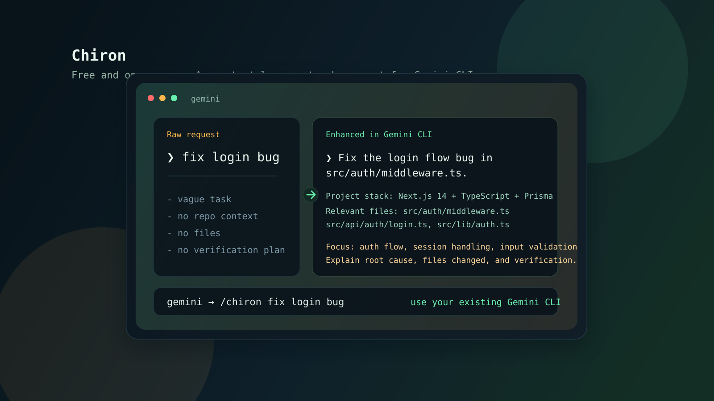
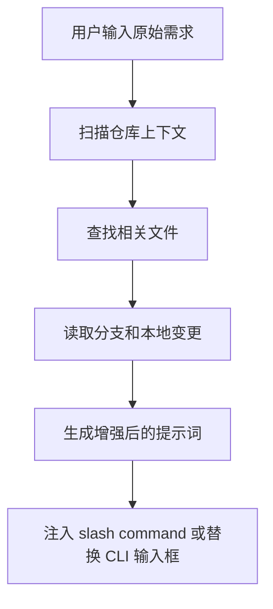

<div align="center">

# 🏹 Chiron

**免费开源的 Augment Code 替代方案，而且在终端式 Gemini CLI 工作流里更顺手。**

把一句模糊需求，增强成带仓库上下文的可执行提示词，并且尽量不离开当前终端工作流。

[English](README.md) · [简体中文](README.zh-CN.md) · [CLI Guide](cli/README.md) · [Docs](docs/README.md)

</div>



## Chiron 是什么

如果你想要的是一种类似 Augment 的体验，但更偏终端、更轻、更容易自己改，Chiron 的目标很明确：

- 先写一句原始需求
- 根据代码仓库上下文增强提示词
- 可以继续编辑，也可以直接执行
- 尽量保持在 Gemini CLI 或 Claude Code 里完成

它更适合这类场景：

- 你主要想增强提示词，而不是换一整套 IDE 工作流
- 你希望能看到或控制增强过程
- 你希望它免费、开源、可修改

## 前置条件

开始之前，确认本机已安装：

| 依赖 | 版本 | 检查命令 |
|------|------|----------|
| [Node.js](https://nodejs.org/) | 18+ | `node -v` |
| [Git](https://git-scm.com/) | 任意 | `git --version` |
| [Gemini CLI](https://github.com/google-gemini/gemini-cli) | 最新 | `gemini --version` |

> **提示：** Gemini CLI 是 Google 官方的终端客户端。如果没装，先运行 `npm install -g @google/gemini-cli`。

## 增强时会补什么

Chiron 不是固定模板拼接。它会尽量结合当前仓库去补全这些信息：

- 技术栈和框架
- 相关文件和邻近代码
- 当前分支和本地变更上下文
- 更明确的任务范围和验收标准
- 验证方式、风险点和回归关注点

所以同一句"修复登录 bug"，在不同项目里得到的增强结果应该不一样。

## 直接装进你现有的 Gemini CLI

你不需要再跑 `/tmp/gemini-cli` 那套开发命令，也不需要 `npm run start` 才能使用 Chiron。

如果你本机已经能直接运行 `gemini`，推荐这样安装：

```bash
git clone https://github.com/EdwinjJ1/chiron-prompt.git ~/.chiron
node ~/.chiron/cli/bin/install-gemini-command.mjs --name chiron
```

然后在任意项目里直接用：

```text
gemini
/chiron 修复登录流程 bug
```

这个安装器会：

- 保留你原来的 `gemini`
- 在 `~/.gemini/commands/` 里写入一个 Chiron 命令
- 用绝对路径连接到 Chiron 的增强脚本

如果你更想用短命令，也可以安装成 `/e`：

```bash
node ~/.chiron/cli/bin/install-gemini-command.mjs --name e --force
```

## 主要用法

### 1. ⭐ 直接在现有 Gemini CLI 里用 `/chiron`（推荐）

这是最推荐的路径，不需要自定义 Gemini 开发版。

安装完上面的命令后：

```text
gemini
/chiron 修复登录流程 bug
```

执行链路：

1. 扫描项目
2. 查找相关文件
3. 生成增强后的提示词
4. 交给 Gemini 继续执行

### 2. 项目内自带的 Gemini `/e`

仓库里已经带了项目级 Gemini 自定义命令 [.gemini/commands/e.toml](.gemini/commands/e.toml)。

```text
gemini
/e 修复登录流程 bug
```

如果这个仓库本身就在项目根目录里，`gemini` 可以直接拾取 `/e`。

### 3. ⭐ Overlay 安装器（类 Augment 体验）

一条命令即可获得带双击 `Ctrl+E` 原地增强的用户级 Gemini CLI：

```bash
node cli/bin/install-gemini-overlay.mjs
```

安装器会：

1. 把你全局 Gemini CLI 复制到 `~/.chiron/gemini-cli`（用户自有）
2. 把 Chiron 运行时复制到 `~/.chiron/cli`
3. 给 overlay 打上双击 `Ctrl+E` 增强补丁
4. 写入 `~/.local/bin/gemini` 包装脚本

| 快捷键 | 功能 |
|--------|------|
| `Ctrl+E` x 1 | 光标移到行尾（默认行为） |
| `Ctrl+E` x 2（500 ms 内） | **原地增强提示词**（显示 `🏹 Chiron enhancing...`），可继续编辑 |
| `Enter` | 正常提交 |

回滚：

```bash
rm -f ~/.local/bin/gemini
rm -rf ~/.chiron
hash -r
```

安装位置：

- Wrapper: `~/.local/bin/gemini`
- Overlay Gemini: `~/.chiron/gemini-cli`
- Chiron 运行时: `~/.chiron/cli`

> 你原来的全局 Gemini CLI 完全不动。

### 4. 直接 patch 全局 Gemini CLI

如果你不想用 overlay，而是直接 patch 全局安装的 Gemini CLI：

```bash
node cli/bin/install-gemini-inplace-enhance.mjs
```

也可以手动 apply patch：

```bash
# 在你的 gemini-cli 仓库目录里
git apply /path/to/chiron/cli/patches/gemini-cli/double-ctrl-e-enhance-in-place.patch
```

完整说明：[cli/patches/gemini-cli/README.md](cli/patches/gemini-cli/README.md)

> **注意：** 此方式会直接修改全局安装。overlay 方式更安全。

### 5. Claude Code 里的 `/e`

仓库也提供了 Claude Code 命令 [.claude/commands/e.md](.claude/commands/e.md)。

配合 MCP server 后，可以得到一条可见的增强链路，而不是黑盒重写。

### 6. 只用 skill

如果你只想要可复用的 skill 行为，不关心 CLI 集成，就直接看 [SKILL.md](SKILL.md)。

## 示例

原始需求：

```text
fix login bug
```

在 Next.js 项目里，增强后可能会变成：

```text
Fix the login flow bug in `src/auth/middleware.ts`.
Project stack: Next.js 14 + TypeScript + Prisma.
Relevant files: `src/auth/middleware.ts`, `src/api/auth/login.ts`, `src/lib/auth.ts`.
Focus on authentication flow, session handling, input validation, and regression risk.
After the change, explain root cause, files changed, and how the fix was verified.
```

实际结果会跟仓库和需求一起变化，不应该每次都长成一个固定模板。

## 增强流程



相关实现：

- [cli/src/context-engine.mjs](cli/src/context-engine.mjs)
- [cli/src/enhancer.mjs](cli/src/enhancer.mjs)
- [cli/bin/chiron-enhance.mjs](cli/bin/chiron-enhance.mjs)

## 选择哪种模式

| 模式 | 适合谁 | 入口 |
|------|--------|------|
| Gemini `/chiron` ⭐ | 想直接在现有全局 `gemini` 上用 | [cli/bin/install-gemini-command.mjs](cli/bin/install-gemini-command.mjs) |
| 项目内 Gemini `/e` | 当前项目已经包含这个仓库 | [.gemini/commands/e.toml](.gemini/commands/e.toml) |
| Overlay 安装器 ⭐ | 类 Augment 双击 `Ctrl+E`，不动全局安装 | [cli/bin/install-gemini-overlay.mjs](cli/bin/install-gemini-overlay.mjs) |
| 直接 patch | 直接修改全局 Gemini CLI | [cli/bin/install-gemini-inplace-enhance.mjs](cli/bin/install-gemini-inplace-enhance.mjs) |
| 手动 patch | 自己 `git apply` .patch 文件 | [cli/patches/gemini-cli/README.md](cli/patches/gemini-cli/README.md) |
| Claude Code `/e` | 想在 Claude Code 里使用仓库感知增强 | [.claude/commands/e.md](.claude/commands/e.md) |
| OpenAI Codex TUI | 给 Codex 开源克隆版添加双击 `Ctrl+E` 原地增强 | [cli/patches/codex/](cli/patches/codex/) |
| 仅 skill | 只想复用增强逻辑 | [SKILL.md](SKILL.md) |

## 仓库结构

```text
.
├── README.md
├── README.zh-CN.md
├── SKILL.md
├── .gemini/
├── .claude/
├── cli/
├── docs/
├── tests/
└── prompt-history/
```

## 快速开始

### 方式 A：现有 Gemini CLI（推荐）

```bash
git clone https://github.com/EdwinjJ1/chiron-prompt.git ~/.chiron
node ~/.chiron/cli/bin/install-gemini-command.mjs --name chiron
```

然后：

```text
gemini
/chiron explain why this auth middleware fails on refresh
```

### 方式 B：项目内 Gemini CLI

1. 让这个仓库出现在你的项目根目录里。
2. 在项目根目录启动 `gemini`。
3. 输入 `/e <你的需求>`。

### 方式 C：Claude Code

1. 按 [cli/README.md](cli/README.md) 配置 MCP server。
2. 保留项目里的 [.claude/commands/e.md](.claude/commands/e.md)。
3. 输入 `/e <你的需求>`。

### 方式 D：Overlay 安装器（类 Augment 双击 Ctrl+E）

```bash
node cli/bin/install-gemini-overlay.mjs
```

1. 打开新终端（或 `hash -r`）。
2. 在任意项目里运行 `gemini`。
3. 输入提示词，按两次 `Ctrl+E` 原地增强。
4. 继续编辑或直接按 `Enter` 提交。

回滚：`rm -f ~/.local/bin/gemini && rm -rf ~/.chiron && hash -r`

### 方式 E：手动 patch

1. 运行 `node cli/bin/install-gemini-inplace-enhance.mjs`，或
2. 按 [cli/patches/gemini-cli/README.md](cli/patches/gemini-cli/README.md) 手动 `git apply`。

### 方式 F：OpenAI Codex TUI 体验

如果你使用开源的 [OpenAI Codex](https://github.com/openai/codex) 终端客户端，Chiron 同样支持双击 `Ctrl+E` 的无缝增强体验。

```bash
git clone https://github.com/openai/codex.git /tmp/openai-codex
node cli/bin/install-codex-source-enhance.mjs --codex-root /tmp/openai-codex
cd /tmp/openai-codex/codex-rs
cargo build --bin codex
export CHIRON_ENHANCER_PATH=~/.chiron/cli/bin/chiron-enhance.mjs
cargo run --bin codex
```

> 大多数用户从 **方式 A** 或 **方式 D** 开始就够了。

## 相关文档

- [README.md](README.md)
- [cli/README.md](cli/README.md)
- [docs/README.md](docs/README.md)
- [docs/examples.md](docs/examples.md)
- [docs/testing.md](docs/testing.md)
- [SKILL.md](SKILL.md)

## License

本项目使用 MIT License，见 [LICENSE.txt](LICENSE.txt)。
